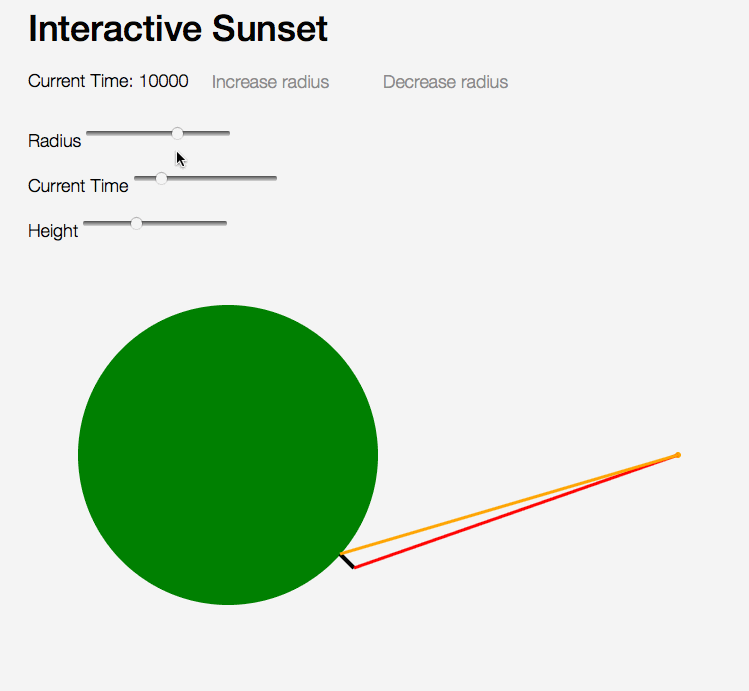

An interactive graphical simulation of a physics problem. A person views the sunset at two different times depending on whether she is lying down or standing up. Identify and understand the relevant variables in the problem: the time difference, diameter of the earth, height of person, rate of planet rotation, etc. (The actual textbook problem gave the person's height and time difference, and asked for an estimate of the earth's diameter.)

Here is an animated gif shownig an old version of the app.

Why the interactivity? Well, just because ... it was fun, and I got to learn ReasonML.

To run: clone this repository, run `npm install`, then `npm run dev`.